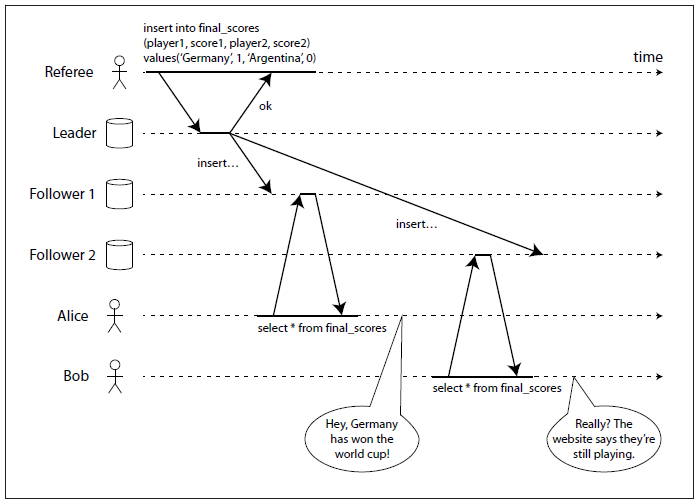
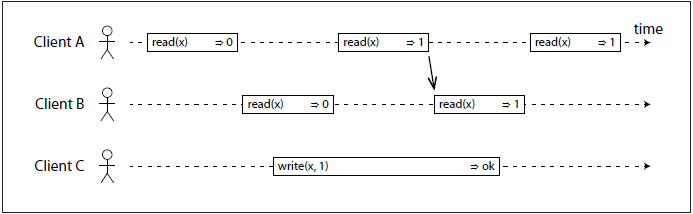
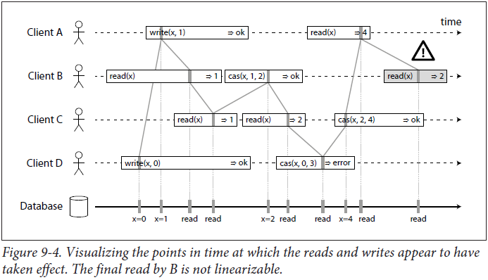

# Consistency & Consensus
Is it better to be alive and wrong or right and dead?
—Jay Kreps, A few notes on Kafka and Jepsen (2013)

## Convergence
If you look at two database nodes at the same
moment in time, you’re likely to see different data on the two nodes, because write
requests arrive on different nodes at different times. These inconsistencies occur no
matter what replication method the database uses (single-leader, multi-leader or
leaderless replication).
Most replicated databases provide at least eventual consistency, which means that if
you stop writing to the database and wait for some unspecified length of time, then
eventually all read requests will return the same value - this is called *convergence*
However this is a very weak consistency!

## Linearizability
**Basic Idea:** to make a system appear as if there was only one copy of the data,
and all operations on it are atomic. With this guarantee, even though there may be
multiple replicas in reality, the application does not need to worry about them.

Consider the image, it tells u an example of what a non-linearizable system looks like :

Alice read the updated value but Bob's request did not reflect it.

**Then what does a linearizable behaviour look like ?**

Consider the following image : 

Note that 2nd read request of B started well before write by C finished. Yet, it returned 1 because A read the value of x as 1. In a linearizable system, if one client’s read returns the new value 1, all subsequent reads must also return the new value, even if the write operation has not yet completed.

Consider a more complex example : 

Note the last read by B, the shaded one. It is not linearizable since A already read the value of x as 4.
- cas(x, vold, vnew) ⇒ r means the client requested an atomic compare-and-set. If the current value of the register x equals vold, it should be atomically set to vnew. If x ≠ vold then the operation should leave the register unchanged and return an error. r is the database’s response (ok or error).

It is possible (though computationally expensive) to test whether a system’s
behavior is linearizable by recording the timings of all requests and responses, and
checking whether they can be arranged into a valid sequential order

## Linearizablity - the Definition
Linearizability is a recency guarantee on reads and writes of a register (an object). It  doesn’t group operations together into transactions, so it does not prevent problems such as write skew unless you take additional measures such as materializing conflicts

## Use of linearizability
1. Locking and leader election
A system that uses single-leader replication needs to ensure that there is indeed only one leader, not several (split brain). One way of electing a leader is to use a : every node that starts up tries to acquire the lock, and the one that succeeds becomes the leader. No matter how this lock is implemented, it must be linearizable: all nodes must agree which node owns the lock, otherwise it is useless.

2. Constraints and uniqueness guarantees
Uniqueness constraints are common in databases: for example, a username or email address must uniquely identify one user, and in a file storage service there cannot be two files with the same path and filename. If you want to enforce this constraint as the data is written (i.e. if two people try to concurrently create a user or a file with the same name, one of them will be returned an error), you need . This situation is actually similar to a lock: when a user registers for your service, you can think of them acquiring a “lock” on their chosen username. 
However, in these situations, you may also be able to get away without linearizability:
• If two people concurrently register the same username or book the same seat, you can send one of them an email to apologize, and ask them to choose a different one. This kind of change to correct a mistake is called a compensating transaction. 

3. Cross-channel timing dependencies
say you have a website where users can upload a photo, and a background process resizes the photos to lower resolution for faster download (thumbnails). The architecture and data flow of this system is illustrated below

If it is not linearizable, there is the risk of a race condition: the message queue (steps 3 and 4 in Figure) might be faster than the internal replication inside the storage service. In this case, when the resizer fetches the image (step 5), it might see an old version of the image, or nothing at all. If it processes an old version of the image, the full-size and the resized images in file storage become permanently inconsistent.

This problem arises because there are two different communication channels
between the web server and the resizer: the file storage and the message queue.
Without the recency guarantee of linearizability, race conditions between these two
channels are possible.

## How to make a system linearizable ?
the simplest answer would be to have only use a single copy of the data. However, that approach would not be able totolerate faults: if the node holding that one copy fails, the data would be lost. The most common approach to making a system fault-tolerant is to use replication, and only a few of those replications support linearizability. 

- Single-leader replication (potentially linearizable)
    In a system with single-leader replication, the leader has the primary copy of the data that is used for writes, and the followers maintain backup copies of the data on other nodes. If you make reads from the leader, or from synchronously updated followers, they have the potential to be linearizable. However, not every single-leader database is actually linearizable, either by design (e.g. because it uses snapshot isolation) or due to concurrency bugs.
    Problems that may arise : 
    possible for a node to think that it is leader, when in fact it is not — and if the delusional leader continues to serve requests, it is likely to violate linearizability. With asynchronous replication, failover may even lose data which violates both durability and linearizability.
- Consensus algorithms (linearizable)
    Some consensus algorithms, bear a resemblance to single-leader replication. However, consensus protocols contain measures to prevent split-brain and stale replicas. Thanks to these details, consensus algorithms can implement linearizable storage safely.
- Multi-leader replication (not linearizable)
    Systems with multi-leader replication are generally not linearizable, because they concurrently process writes on multiple nodes and asynchronously replicate them to other nodes. For this reason, they can produce conflicting writes that require resolution
- Leaderless replication (probably not linearizable)
    For systems with leaderless replication (Dynamo-style), people sometimes claim that you can obtain “strong consistency” by requiring quorum reads and writes (w + r > n). Depending on the exact configuration of the quorums, and depending on how you define strong consistency, this is not quite true.

    “Last write wins” conflict resolution methods based on time-of-day clocks (e.g. in
    Cassandra) are almost certainly non-linearizable, because clock timestamps cannot be guaranteed to be consistent with actual event ordering due to clock skew. Sloppy quorums also ruin any chance of linearizability. Even with strict quorums, non-linearizable behavior is possible. 
